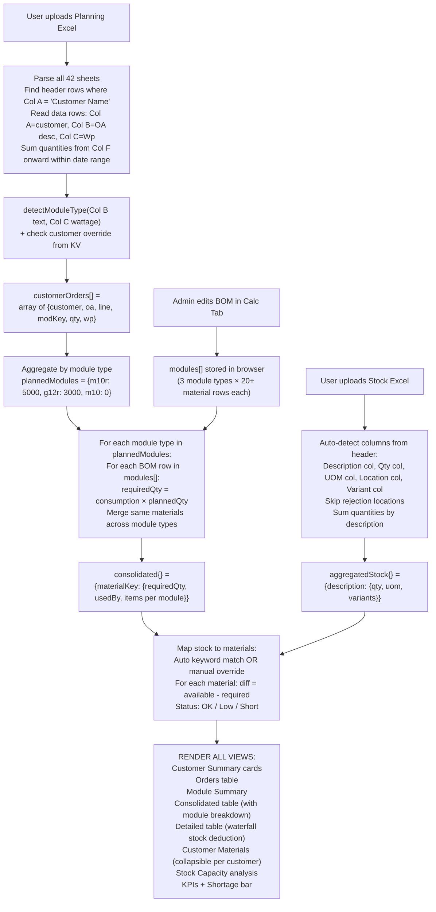

# SCM Ease — How Everything Works (Simple Explanation)

> Read this file to understand what each tab does, how data flows between tabs, and exactly which Excel columns map to what.

---

## THE BIG PICTURE — What Is This App?

SCM Ease helps a solar panel factory answer one question: **"Do we have enough raw materials to build the panels our customers ordered?"**

To answer that, it needs 3 things:
1. **What materials does each panel type need?** → Consumption (Calc) Tab
2. **How many panels did customers order?** → Planning Tab (from Excel upload)
3. **What materials do we have in the warehouse?** → Planning Tab (from Stock Excel upload)

Then it does the math: `Materials Needed = BOM per panel × Number of panels ordered`
And compares with stock: `Shortage = Materials Needed − Materials Available`

---

## HOW TABS ARE CONNECTED

```
┌─────────────────────────────────────────────────────────────────────────────────┐
│                         SCM Ease — Tab Connection Map                          │
│                                                                                 │
│  ┌──────────────┐         ┌──────────────┐                                      │
│  │  CALC TAB    │────────▶│  PLAN TAB    │    Calc tab tells Plan tab:          │
│  │ (Consumption)│  BOM    │ (Planning)   │    "Each M10R panel needs 72 cells,  │
│  │              │  data   │              │     1.5% wastage, etc."              │
│  └──────────────┘         └──────┬───────┘                                      │
│                                  │                                               │
│              Plan tab uses BOM + uploaded Excel files to calculate               │
│              material requirements and compare with warehouse stock              │
│                                  │                                               │
│  ┌──────────────┐                │         ┌──────────────┐                      │
│  │  CELL TAB    │  (standalone)  │         │  VENDOR TAB  │  (standalone)        │
│  │ Cell pricing │                │         │ Vendor prices│                      │
│  └──────────────┘                │         └──────────────┘                      │
│                                  │                                               │
│  ┌──────────────┐         ┌──────┴───────┐                                      │
│  │  3D EXPLORER │         │  ADMIN TABS  │                                      │
│  │ 3D module viz│         │ Log + Users  │                                      │
│  └──────────────┘         └──────────────┘                                      │
│                                                                                 │
│  IMPORTANT: Only Calc → Plan have a data link.                                  │
│  Cell, Vendor, 3D, Admin are all independent — no data flows between them.      │
└─────────────────────────────────────────────────────────────────────────────────┘
```

---

## TAB 1: CALCULATOR (CONSUMPTION) TAB

### What it does
Defines the **Bill of Materials (BOM)** — a recipe for each panel type. Like a recipe card that says "to make 1 panel, you need 72 solar cells, 2 sheets of glass, 15m of ribbon..." etc.

### The 3 panel (module) types

| Key | Name | Cell Size | Wattage Range | Technology |
|-----|------|-----------|--------------|------------|
| `m10r` | M10R Topcon | 182mm | 580-600 Wp | TopCon (newer) |
| `g12r` | G12R Topcon | 210mm | 600+ Wp | TopCon (newer) |
| `m10` | M10 Mono PERC | 182mm | 400-579 Wp | Mono PERC (older) |

### BOM table — what each row means

Each module type has ~20-30 rows. Each row is one material:

| Column | What It Means | Example |
|--------|---------------|---------|
| Sr No | Row number | 1 |
| Material Group | Category of material | "Solar Cell" |
| Specification | Exact material description | "TopCon Crystalline 182.2×183.75mm M10R 16BB" |
| UOM | Unit of measurement | "Nos" (numbers), "Mtr" (meters), "Kg" |
| Qty per Module | How many of this material for 1 panel | 72 |
| Wastage % | How much extra to account for breakage/waste | 1.5% |
| Consumption | Auto-calculated: `Qty × (1 + Wastage/100)` | 72 × 1.015 = 73.08 |

### What you can edit
- **Qty per Module** — change how many of each material per panel
- **Wastage %** — change waste percentage
- **Module Qty** — "I want to build 5000 of these" (just for this tab's summary, does NOT affect Planning)
- **Pricing** — add price per material for costing

### How data is saved
- Every edit → saved to your browser (`localStorage` key: `rmConsv2`)
- **"Deploy Changes" button** → pushes updated BOM to GitHub so everyone gets it
- **"Save as Default" button** → saves to cloud (Cloudflare KV) so any user can "Reset to Default"

### THE KEY LINK TO PLANNING TAB
The BOM data (all rows with group, spec, qty, wastage, consumption) is stored in a variable called `modules[]`. When the Planning tab runs its analysis, it reads from this same `modules[]` to know what materials each panel type needs.

```
CALC TAB creates/edits:                    PLAN TAB reads:
┌──────────────────────┐                   ┌──────────────────────┐
│ modules[0] = M10R    │                   │ "M10R needs 72 cells │
│   row[0]: Solar Cell │──────────────────▶│  with 1.5% wastage   │
│     qty: 72          │                   │  = 73.08 consumption" │
│     wastage: 1.5     │                   │                      │
│     consumption: 73  │                   │ So for 5000 M10R:    │
│   row[1]: Glass      │                   │ 73.08 × 5000 = 365K  │
│     qty: 2           │                   │ solar cells needed"   │
│     ...20 more rows  │                   └──────────────────────┘
└──────────────────────┘
```

---

## TAB 2: PLANNING TAB (The Main Engine)

### What it does
You upload 2 Excel files, it crunches the numbers, and tells you what materials you need and what you're short on.

### STEP-BY-STEP: What happens when you upload files

---

### UPLOAD 1: Production Planning Sheet (.xlsx)

This Excel file has 42+ sheets (one per month: March'23, April'23... July'26).

**What each sheet looks like:**

```
Row 0 (Header): Customer Name | OA No, Line-A | Module Wp | Order Qty | Total Order | 15-Jun | 16-Jun | 17-Jun | ...
Row 1 (Data):   DD DISTRIB    | Topcon G to G | 585       | 10000     | 5.85        | 200    | 300    | 250    | ...
Row 2 (Data):   UNISOL        | Mono Bifacial | 545       | 5000      | 2.725       | 100    | 150    | 0      | ...
```

**Column-by-column mapping — what the code reads:**

| Excel Column | Index | What The Code Does With It |
|--------------|-------|---------------------------|
| **Column A** (col 0) | Customer Name | → `ord.customer` — who ordered it |
| **Column B** (col 1) | OA No + Line info | → `ord.oa` — order description. Also detects **production line** (Line-A/B/C/D/OEM) from the header row. Also fed to `detectModuleType()` to figure out panel type |
| **Column C** (col 2) | Module Wp (wattage) | → `ord.wp` — used by `detectModuleType()` + power calculation |
| **Column D** (col 3) | Order Qty | (not directly used — daily quantities are summed instead) |
| **Column E** (col 4) | Total Order MW | (not directly used) |
| **Column F onward** (col 5, 6, 7...) | Daily quantities by date | → These are the actual production numbers. Code **sums up all quantities in user's selected date range** → `ord.qty` |

**How the header row is detected:**
- Code scans every row. When `Column A = "Customer Name"`, that row is a header.
- Column B of the header tells which production line (e.g., "OA No, Line-A" → Line A)
- Columns F onward in the header contain dates (as Excel serial numbers like 46192 = Jun 15, 2026)

**How module type is detected** (`detectModuleType` function):

```
OA Description (col B)          + Wattage (col C)  →  Module Type
─────────────────────────────────────────────────────────────────
Contains "topcon" + "g to g"    + any Wp            →  m10r (if Wp<600) or g12r (if Wp≥600)
Contains "topcon" only          + any Wp            →  m10r (if Wp<600) or g12r (if Wp≥600)
Contains "mono bifacial"        + any Wp            →  m10 (Mono PERC)
Contains "monofacial"           + any Wp            →  m10 (Mono PERC)
Contains "bifacial"             + any Wp            →  m10 (Mono PERC)
No keyword match                + 580-599 Wp        →  m10r
No keyword match                + 400-579 Wp        →  m10
No keyword match                + 600+ Wp           →  g12r

OVERRIDE: If admin set a customer override (e.g., "DD DISTRIB → always m10r"),
          that overrides all auto-detection above.
```

**What comes out — `customerOrders[]`:**
```
[
  { customer: "DD DISTRIB", oa: "Topcon G to G-OA/26", line: "A", modKey: "m10r", qty: 5000, wp: 585 },
  { customer: "UNISOL", oa: "Mono Bifacial 545", line: "B", modKey: "m10", qty: 3000, wp: 545 },
  ...
]
```

---

### UPLOAD 2: Store Stock Report (.xlsx)

This is your warehouse inventory report.

**What the code reads (auto-detects columns from header row):**

| Column Header It Looks For | What It Stores | Example |
|---------------------------|----------------|---------|
| "Description" | Material description → key for matching | "TopCon Crystalline Silicon Cell 182.2×183.75mm" |
| "Quantity" or "Qty" | How much is in stock | 500000 |
| "Unit" or "UOM" | Unit of measurement | "Nos" |
| "Location" | Warehouse location → **skips "rej" (rejection) locations** | "Main Store" |
| "Variant" / "Item Variant" | Variant code (e.g., lot/batch) | "V001" |
| "Variant Name" | Variant description | "Lot March 2026" |
| "Item Code" / "Material Code" | Material code for reference | "RM-001" |

**Stock data is aggregated:** All rows with the same Description are summed up (ignoring rejection locations).

**What comes out — `aggregatedStock{}`:**
```
{
  "TopCon Crystalline Silicon Cell 182mm": { qty: 500000, uom: "Nos", cat: "Raw Material", variants: { "V001": 200000, "V002": 300000 } },
  "3.2mm Tempered Solar Glass": { qty: 25000, uom: "Nos", cat: "Raw Material", variants: {} },
  ...
}
```

---

### STEP 3: THE MATH — How Requirements Are Calculated

```
Planning says:           BOM says:                      Result:
"Build 5000 M10R"   ×   "Each M10R needs 73.08 cells"  =  365,400 cells needed
"Build 3000 G12R"   ×   "Each G12R needs 73.08 cells"  =  219,240 cells needed
                                                        ─────────────────────────
                                           TOTAL CELLS:   584,640 cells needed

Stock says: 500,000 cells available
SHORTAGE: 584,640 − 500,000 = 84,640 cells SHORT ❌
```

**In code terms:**

```
For each planned module type (m10r, g12r, m10):
  For each BOM row (Solar Cell, Glass, Ribbon...):
    materialKey = "Material Group|||Specification"     (e.g., "Solar Cell|||TopCon 182mm")
    consumption = qty_per_module × (1 + wastage/100)   (e.g., 72 × 1.015 = 73.08)
    requiredQty = consumption × total_planned_modules   (e.g., 73.08 × 5000 = 365,400)
    
    → Same material from different module types gets MERGED
    → e.g., if both M10R and G12R use same glass, their needs add up
```

**What comes out — `consolidated{}`:**
```
{
  "Solar Cell|||TopCon 182mm": {
    group: "Solar Cell",
    spec: "TopCon Crystalline 182mm",
    requiredQty: 584640,     // total needed across all module types
    usedBy: ["M10R Topcon", "G12R Topcon"],
    items: [                 // breakdown by module type
      { modKey: "m10r", qty: 5000, consumption: 73.08 },   // 5000 × 73.08 = 365,400
      { modKey: "g12r", qty: 3000, consumption: 73.08 }    // 3000 × 73.08 = 219,240
    ]
  }
}
```

---

### STEP 4: STOCK MAPPING — Matching Warehouse Items to BOM Materials

The BOM says "Solar Cell TopCon 182mm" but the warehouse says "TopCon Crystalline Silicon Cell 182.2×183.75mm". These are the same item with different names.

**How matching works:**
1. **Auto-match:** The code breaks the BOM spec into keywords and looks for stock items that share those keywords + dimensions
2. **Manual override:** User can click the 🔗 button to manually map any stock item to any material
3. **Customer-specific mapping:** Each customer can have their own stock mappings (e.g., customer A's solar cells come from a different lot)

**Stock mapping result:**
```
Material: "Solar Cell|||TopCon 182mm"
  → Mapped to stock: "TopCon Crystalline Silicon Cell 182.2×183.75mm" (500,000 Nos)
  → Required: 584,640
  → Available: 500,000  
  → Diff: -84,640 (SHORT ❌)
```

**Status badges:**
- ✅ OK = stock ≥ required
- ⚠️ Low = stock ≥ 50% of required but < 100%
- ❌ Short = stock < 50% of required
- 🚫 Discarded = user chose to ignore this material

---

### PLANNING TAB VIEWS — What Each View Shows

| View | What You See | Data Source |
|------|-------------|-------------|
| **Customer Summary** | Cards showing each customer + their total modules + MW + module type override dropdown | `customerOrders[]` grouped by customer |
| **Orders Table** | Full table of every order line: customer, OA, line, module type, Wp, qty, power | `customerOrders[]` flat list |
| **Module Summary** | Cards per module type: total qty, Wp values, total power | `plannedModules{}` |
| **Consolidated Materials** | THE MAIN TABLE — every material needed, required qty, mapped stock, shortage, with module-wise breakdown in "Used By" | `consolidated{}` + `aggregatedStock{}` |
| **Detailed Breakdown** | Same as consolidated but split by module type — shows waterfall: M10R eats from stock pool first, then G12R sees what's left | `plannedModules{}` × `modules[]` BOM |
| **Customer Materials** | Collapsible per-customer sections — each customer's required materials + their own stock mappings + module-type breakdown | `customerOrders[]` × `modules[]` BOM |
| **Stock Capacity** | How many days/modules can current stock support | Reverse calc from `consolidated{}` |

---

## TAB 3: CELL INV TAB (Standalone)

Simple pricing calculator for solar cells. No connection to other tabs.

| Column | Purpose |
|--------|---------|
| Sr No | Row number |
| Description | Cell type description |
| Size | Cell dimensions |
| Qty | How many cells |
| Price (USD) | Unit price in dollars |
| INR Rate | USD to INR conversion rate |
| Total (INR) | Auto-calculated: Qty × Price × INR Rate |

Saved to: `localStorage` key `cellInvData`

---

## TAB 4: VENDOR TAB (Standalone)

Editable spreadsheet for vendor price comparisons. No connection to other tabs.

- Requires vendor login (name + password)
- Edit mode controlled by admin permission (`vendor_edit`)
- Data saved to Cloudflare KV (shared across all users)
- Users with only "view" permission see it read-only

---

## TAB 5: 3D EXPLORER (Standalone)

Loads a 3D solar module visualization in an iframe (`3d-explorer.html`). No data connection to anything. Unloads when you leave the tab to save CPU/GPU.

---

## TAB 6-7: ADMIN TABS (Log + Users)

Only visible when admin is logged in.

**Log Tab:** Shows activity history — who logged in, what was deployed, when.
**Users Tab:**
- **Users sub-tab:** Add/delete users, change passwords
- **Permissions sub-tab:** Toggle matrix — for each user, turn on/off access to: Calc, Plan (view), Plan (edit), Cell, Vendor (view), Vendor (edit), Explorer

---

## WHERE DATA IS STORED

```
YOUR BROWSER ONLY (localStorage):
├── rmConsv2           → Calc tab BOM data, module quantities, pricing
├── rmPlanOverrides    → Planning stock mappings, discarded materials, customer mappings
└── cellInvData        → Cell INV tab rows

YOUR BROWSER ONLY (sessionStorage — cleared when tab closes):
├── siteUser           → Logged-in username
├── adminToken         → Admin JWT token
├── vendorUser         → Vendor tab username
├── userPermissions    → Cached permissions JSON
├── planEditPerm       → "1" or "0"
└── vendorEditPerm     → "1" or "0"

YOUR BROWSER ONLY (IndexedDB — large data, no size limit):
├── rmAnalysisState    → Full analysis results (customerOrders, consolidated, stock data)
└── rmRawData          → Raw Excel data (so you can re-run analysis without re-uploading)

CLOUD (Cloudflare KV — shared across ALL users):
├── app_users              → User list (name + password)
├── user_permissions       → Per-user tab permissions
├── consumption_defaults   → Admin-saved default BOM
├── customer_mappings_data → Customer stock mappings (from Planning tab)
├── planning_config        → Customer module type overrides
└── activity_log           → Activity history (last 500 entries)
```

---

## THE COMPLETE DATA FLOW — From Upload to Shortage Report



---

## WHAT CHANGES WHAT — Quick Reference

| If you change THIS... | THESE things update... |
|----------------------|----------------------|
| BOM qty/wastage in Calc tab | Next time Planning runs analysis, required quantities change |
| Upload new Planning Excel | All orders re-parsed, all quantities recalculated |
| Upload new Stock Excel | Stock mapping re-evaluated, all shortage statuses update |
| Date range filter | Only quantities within that date range are summed |
| Customer module type override | That customer's orders remapped to new module type, consolidated totals change |
| Stock mapping (🔗 button) | Shortage status for that material updates |
| Discard a material | That material is ignored in all calculations |
| Admin changes user permissions | That user sees/hides tabs on next login |
| Admin deploys BOM changes | All users get updated BOM (module recipes) |

---

## API ENDPOINTS — What The Backend Does

| URL | When It's Called | What It Does |
|-----|-----------------|-------------|
| POST `/api/login` | Admin login form | Checks ID+password, returns JWT token |
| POST `/api/verify-user` | Gate login (normal users) | Checks name+password against user list |
| POST `/api/user-permissions` | After gate login | Returns that user's tab permissions |
| POST `/api/save` | Admin clicks "Deploy Changes" | Commits updated BOM to GitHub repo |
| GET `/api/consumption-defaults` | User clicks "Reset to Default" | Returns admin-saved default BOM |
| POST `/api/consumption-defaults` | Admin clicks "Save as Default" | Saves current BOM as default |
| GET `/api/planning-config` | Page loads | Returns customer module type overrides |
| POST `/api/planning-config` | User saves module type overrides | Stores overrides for all users |
| GET `/api/customer-data` | Planning analysis loads | Returns customer stock mappings |
| POST `/api/customer-data` | User changes customer mapping | Saves customer stock mappings |
| GET `/api/users` | Admin opens Users tab | Returns all usernames + passwords |
| GET `/api/permissions` | Admin opens Permissions sub-tab | Returns all user permission settings |
| GET `/api/logs` | Admin opens Log tab | Returns activity log entries |
