# SCM Ease — Data Flow Diagram

## Master Data Flow

```mermaid
flowchart TB
    subgraph USER_INPUT["User Input"]
        GATE["Gate Login<br/>(name + password)"]
        ADMIN["Admin Login<br/>(ID + password)"]
    end

    subgraph AUTH["Authentication"]
        VERIFY["POST /api/verify-user"]
        LOGIN["POST /api/login → JWT"]
        PERMS["POST /api/user-permissions"]
    end

    GATE --> VERIFY --> |"sessionStorage: siteUser"| PERMS
    ADMIN --> LOGIN --> |"sessionStorage: adminToken"| SHOW_ADMIN
    PERMS --> |"sessionStorage: userPermissions,<br/>planEditPerm, vendorEditPerm"| TAB_VIS

    subgraph TAB_VIS["Tab Visibility (applyUserPermissions)"]
        T_CALC["Calc Tab"]
        T_PLAN["Plan Tab"]
        T_CELL["Cell Tab"]
        T_VENDOR["Vendor Tab"]
        T_EXPLORER["Explorer Tab"]
        SHOW_ADMIN["Log + Users Tabs<br/>(admin only)"]
    end

    subgraph CALC_TAB["Calculator (Consumption) Tab"]
        direction TB
        BASE["baseModules[]<br/>(3 module types × 20+ BOM rows)"]
        EDIT_BOM["Edit BOM rows<br/>(qty, wastage, spec)"]
        MOD_QTY["Set module qty<br/>& generation (MW/kW)"]
        RENDER["render() → consumption calc<br/>consumption = qty × (1 + wastage/100)"]
        SAVE_STATE["saveState() → localStorage 'rmConsv2'"]
        DEPLOY["Deploy Changes<br/>POST /api/save → GitHub commit"]
        SAVE_DEFAULTS["Save Defaults<br/>POST /api/consumption-defaults → KV"]
        RESET_DEFAULTS["Reset Defaults<br/>GET /api/consumption-defaults"]

        BASE --> EDIT_BOM --> RENDER
        MOD_QTY --> RENDER
        RENDER --> SAVE_STATE
        RENDER --> DEPLOY
        RENDER --> SAVE_DEFAULTS
        RESET_DEFAULTS --> BASE
    end

    subgraph PLAN_TAB["Planning Tab"]
        direction TB
        UPLOAD_PLAN["Upload Planning Sheet<br/>(.xlsx, 42 sheets)"]
        UPLOAD_STOCK["Upload Stock Report<br/>(.xlsx)"]
        PARSE_PLAN["Parse Planning:<br/>- Find headers<br/>- Extract customer, OA, Wp, dates<br/>- detectModuleType(oaDesc, wp)"]
        PARSE_STOCK["Parse Stock:<br/>- Auto-detect columns<br/>- Aggregate by description<br/>- Track variants"]
        AGG_MODULES["Aggregate planned modules:<br/>plannedModules = { m10r: {qty, wpValues} }"]
        CONSOLIDATE["Build consolidated materials:<br/>For each module type → expand BOM rows<br/>materialKey = group|||spec<br/>requiredQty = consumption × plannedQty"]
        MAP_STOCK["Map stock to materials:<br/>- Auto keyword/dimension match<br/>- Apply user overrides<br/>- Calc diff = available - required<br/>- Status: ok/low/short"]
        
        UPLOAD_PLAN --> PARSE_PLAN
        UPLOAD_STOCK --> PARSE_STOCK
        PARSE_PLAN --> AGG_MODULES
        AGG_MODULES --> CONSOLIDATE
        CONSOLIDATE --> MAP_STOCK
        PARSE_STOCK --> MAP_STOCK
    end

    subgraph PLAN_VIEWS["Planning Views"]
        V_CUST["Customer Orders Table"]
        V_CUSTMAT["Customer Materials Mapping"]
        V_MODSUMM["Module Summary"]
        V_CONSOL["Consolidated Materials<br/>(+ stock mapping dropdowns)"]
        V_DETAIL["Detailed Breakdown"]
        V_CAPACITY["Stock Capacity Analysis"]
    end

    MAP_STOCK --> V_CUST
    MAP_STOCK --> V_CUSTMAT
    MAP_STOCK --> V_MODSUMM
    MAP_STOCK --> V_CONSOL
    MAP_STOCK --> V_DETAIL
    MAP_STOCK --> V_CAPACITY

    subgraph PLAN_STORAGE["Planning Data Storage"]
        LS_PLAN["localStorage: rmPlanOverrides<br/>(stockMappingOverrides, discardedMaterials,<br/>customerStockMappings, customerVariantSelections)"]
        IDB_STATE["IndexedDB: rmAnalysisState<br/>(lastAnalysis, aggregatedStock, dates)"]
        IDB_RAW["IndexedDB: rmRawData<br/>(planRaw, stockRaw, planFmt)"]
        KV_CUST["Cloudflare KV: customer_mappings_data<br/>(shared across all users)"]
        KV_PLANCONF["Cloudflare KV: planning_config<br/>(customer module type overrides, shared)"]
    end

    MAP_STOCK --> LS_PLAN
    MAP_STOCK --> IDB_STATE
    UPLOAD_PLAN --> IDB_RAW
    LS_PLAN --> KV_CUST
    KV_PLANCONF --> PARSE_PLAN

    subgraph CELL_TAB["Cell INV Tab"]
        CELL_TBL["Editable pricing table<br/>USD/INR conversion"]
        CELL_LS["localStorage: cellInvData"]
        CELL_TBL --> CELL_LS
    end

    subgraph VENDOR_TAB["Vendor Tab"]
        VEND_LOGIN["Vendor auth check"]
        VEND_TABLE["Editable spreadsheet table"]
        VEND_KV["Cloudflare KV: vendor data"]
        VEND_LOGIN --> VEND_TABLE --> VEND_KV
    end

    subgraph EXPLORER_TAB["3D Explorer Tab"]
        IFRAME["3d-explorer.html (iframe)<br/>Loads on tab enter, unloads on leave"]
    end

    subgraph ADMIN_TABS["Admin Tabs"]
        LOG_TAB["Log Tab<br/>GET /api/logs"]
        USERS_TAB["Users Tab"]
        USERS_LIST["Sub: User List<br/>Add/Edit/Delete users"]
        PERMS_TAB["Sub: Permissions<br/>8-column toggle matrix"]
        USERS_TAB --> USERS_LIST
        USERS_TAB --> PERMS_TAB
    end

    %% Cross-tab data dependencies
    SAVE_STATE -.-> |"modules[] BOM data<br/>used by planning"| CONSOLIDATE
    PERMS --> TAB_VIS

    style USER_INPUT fill:#f0f0f0,stroke:#333
    style CALC_TAB fill:#e8f5e9,stroke:#2e7d32
    style PLAN_TAB fill:#e3f2fd,stroke:#1565c0
    style PLAN_VIEWS fill:#e1f5fe,stroke:#0277bd
    style PLAN_STORAGE fill:#fff3e0,stroke:#e65100
    style ADMIN_TABS fill:#fce4ec,stroke:#c62828
    style AUTH fill:#f3e5f5,stroke:#6a1b9a
```

## Data Dependency Summary

| Source | → | Destination | Data |
|--------|---|-------------|------|
| Consumption Tab | → | Planning Tab | `modules[]` BOM rows (qty, wastage, consumption per material) |
| Planning Excel Upload | → | Analysis Engine | Customer orders (customer, OA, Wp, qty by date) |
| Stock Excel Upload | → | Analysis Engine | Available stock (description, qty, variants) |
| Analysis Engine | → | Views | customerOrders, plannedModules, consolidated, stock mapping |
| User overrides (UI) | → | localStorage | stockMappingOverrides, discardedMaterials |
| localStorage | → | Cloudflare KV | Customer mappings (shared with all users) |
| Cloudflare KV | → | Planning Analysis | Customer module type overrides, customer material mappings |
| Admin permissions | → | Tab visibility | Per-user tab access + edit permissions |
| Admin consumption defaults | → | Consumption Tab | Reset BOM to saved defaults |

## Key: What Changes When

| When This Changes... | These Update... |
|---------------------|-----------------|
| User uploads new Planning sheet | All analysis re-runs, new customerOrders, new consolidated materials |
| User uploads new Stock sheet | Stock mapping re-evaluated, shortages recalculated |
| Admin edits BOM in Consumption tab | requiredQty changes in planning (on next analysis run) |
| Admin saves consumption defaults | Defaults available for all users to reset to |
| Admin changes module qty | Only affects consumption tab summary, NOT planning |
| User changes stock mapping | Shortage status updates, saved to localStorage + KV |
| User changes date range filter | Only date-range filtered quantities change, materials recalculate |
| Admin changes module type for customer | Customer's orders re-mapped, consolidated totals change |
